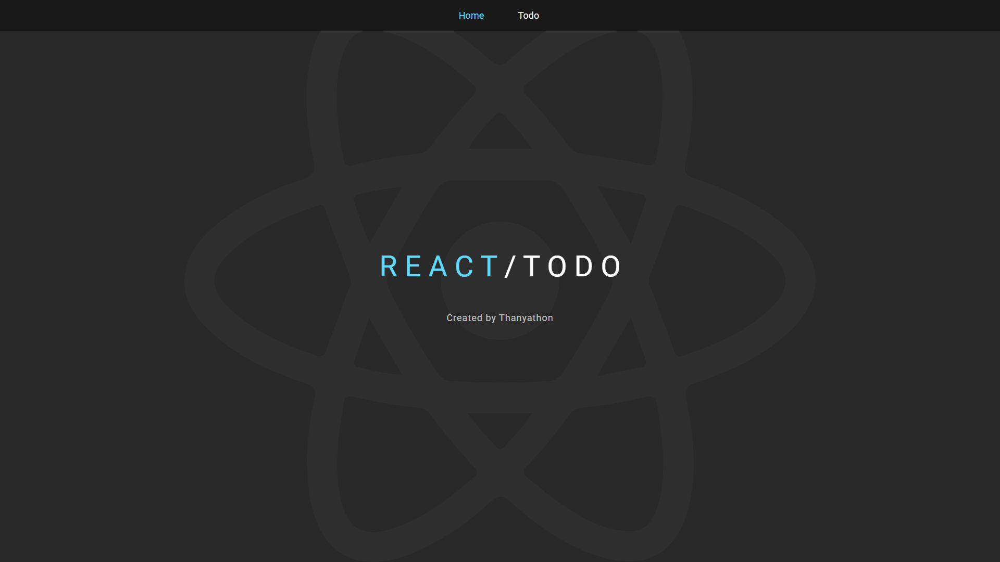

# React Todo

Deploy [here](https://bloodzmoon.github.io/react-todo/) with Github Page

## Differrent framework

- [Angular](https://github.com/bloodzmoon/angular-todo)
- [Vue](https://github.com/bloodzmoon/vue-todo)
- [Svelte](https://github.com/bloodzmoon/svelte-todo)

## Credit

Created by [me](https://github.com/bloodzmoon) with ❤
